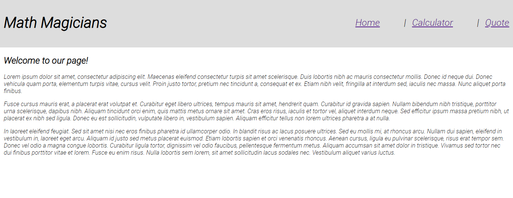

# Project Name

> Get ready to do all the calculations you want, and get inspired by the greatest mathematicians ever.



## Built With

- Major languages
    - JavaScript
    - HTML & CSS
- Frameworks
    - React
- Technologies used
    - NodeJS
    - VSCode
<!-- 
## Live Demo

[Live Demo Link](https://livedemo.com) -->


## Getting Started


To get a local copy up and running follow these simple example steps.

### Prerequisites

- Have NodeJS installed
- Have Git Bash installed
- Have a code editor

### Setup

- Get this repository on your computer using ```git clone https://github.com/JuliCarracedo/math-magicians.git``` on any folder
- Open the created folder on your code editor

### Install

- Run ```npm install``` using your integrated console

### Usage

- You can launch the React app using ```npm start``` on your integrated console

## Author

👤 **Julian Carracedo**

- GitHub: [@JuliCarracedo](https://github.com/JuliCarracedo)
- Twitter: [@CarracedoTrigo](https://twitter.com/CarracedoTrigo)
- LinkedIn: [Julian Carracedo](https://linkedin.com/in/julian-carracedo)
## 🤝 Contributing

Contributions, issues, and feature requests are welcome!

## Show your support

Give a ⭐️ if you like this project!

## Acknowledgments

- Hat tip to anyone whose code was used
- Inspiration
- etc

## 📝 License

This project is [MIT](./MIT.md) licensed.